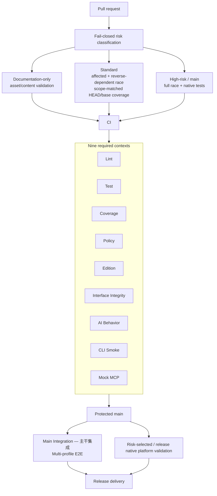

# Architecture

`dws` is a Go CLI with a versioned, static command surface for DingTalk MCP capabilities. Cobra help serves humans; runtime-assembled Schema (`ResolveSchemaBuild`) serves AI agents.

## High-Level Flow

1. `cmd` is the CLI entrypoint, invoking `internal/app` to build the root Cobra command tree.
2. `internal/app` wires static utility commands (`auth`, `audit`, `schema`, `completion`), product helpers, and versioned plugin descriptors.
3. `internal/helpers` contains the main command handlers for all product surfaces (`dev`, `chat`, `calendar`, `contact`, `aitable`, etc.).
4. `internal/executor` and `internal/transport` execute MCP JSON-RPC calls; `internal/output` formats responses.
5. `internal/auth` manages login state, PAT tokens, and agent-code detection.
6. Schema assembly (`ResolveSchemaBuild`) starts from the reviewed `CommandRegistry`, binds each identity to the exact current Cobra leaf, and then resolves typed constraints, sanitized MCP snapshots, and leaf ContractFinal / ProductDecl into one `SchemaRegistry`. Startup and Schema queries do not call MCP `tools/list`. There is no generate-written Catalog delivery step.
7. Production Catalog / `ResolveMeta` consume the lazily assembled registry via `RegisterSchemaSourceRoot` → `ResolveSchemaBuild` / `deliverySchemaCatalog` (声明即 Catalog; lazy `sync.Once`). `ResolveMeta` projects Identity/Safety/Selection from that assembly into an in-process map cache — not a committed `schema_catalog/` or `schema_meta_index.*` fixture. Flag-to-interface property delivery is owned by leaf `ParamDecl.Property` (native annotations). `schema_parameter_mapping_ledger.go` holds reviewed `mapping_exclusions` / `removals` (the empty `schema_parameter_bindings.json` audit table is retired). CLI `required` and constraints come from the resolved typed contract, while MCP `required` remains interface-only metadata.
8. Agent selection results are fixed in versioned review inputs. Every public tool has explicit use/avoid/example and interface disposition metadata; Skill references that are not current leaves require an explicit alias/group/stale/out-of-surface review instead of fuzzy runtime matching.

## Repository Structure

- `cmd`: CLI entrypoint
- `internal/app`: root command wiring, static utility commands, and plugin loading
- `internal/helpers`: product command handlers (dev, chat, calendar, contact, etc.)
- `internal/plugin`: versioned plugin manifest, hook, skill, and transport descriptor loading
- `internal/cli`: Schema assembly, `dws schema` query, and catalog contracts
- `internal/generator`: CI/determinism tools (`cmd_schema_catalog` dump) and param-alias generate
- `internal/executor`: invocation dispatch and result handling
- `internal/transport`: MCP HTTP client and request signing
- `internal/auth`: login, token management, agent-code detection, identity
- `internal/audit`: user operation audit log (JSONL, hash chain, forwarding)
- `internal/errors`: structured error model with categories and hints
- `internal/keychain`: OS keychain integration for credential storage
- `internal/security`: endpoint allowlist and domain trust
- `internal/safety`: runtime safety checks (confirm prompts, dry-run guards)
- `internal/cobracmd`: shared Cobra command builders
- `internal/corecmd`: dispatch-agnostic leaf-command base — flag registration,
  alias/env/default value resolution, required and cross-flag constraint
  validation, Risk write confirmation, toolArgs assembly, Runtime Schema
  projection. Distinct from `internal/cobracmd` (generic tree helpers): it owns
  the declarative leaf contract (`corecmd.Spec`) that the LeafSpec framework is
  built on and that the Shortcut adapter projects into.
- `internal/pat`: PAT (Personal Access Token) authorization flow
- `internal/output`: response formatting (json, table, raw, pretty)
- `internal/logging`: structured logging and argument sanitization
- `internal/tui`: terminal UI helpers
- `pkg/configmeta`: environment variable registry and documentation
- `pkg/config`: configuration constants and paths
- `pkg/edition`: edition detection (oss vs enterprise)
- `pkg/mcptypes`: MCP protocol type definitions
- `internal/syncdata`: generated static endpoint and command-routing data synced from the Wukong baseline
- `skills/`: bundled agent skills (mono/ and multi/ layouts)
- `test/`: CLI, integration, contract, unit, and skill E2E tests
- `scripts/`: install scripts, policy checks, and CI helpers

## Quality Pipeline

Quality enforcement is layered so a pull request receives fast, deterministic
admission feedback without pretending that downstream integration has already
run.

All nine named contexts are produced for every tier. Domain-specific helpers
run when their owned surface is affected; otherwise the corresponding context
records an explicit unaffected success. Standard code changes still receive
representative Darwin/Windows compilation. High-risk PRs and protected `main`
run the complete race and native test suites, while platform-sensitive diffs
also receive native changed-code coverage.

Review orchestration is also base-owned: it requests one eligible peer without
executing PR code, re-routes an updated head when needed, and auto-merge
completes only after the latest push has peer approval plus the current
revision's nine strict contexts. Complete Multi-profile E2E remains downstream
of PR admission. See [`docs/ci-pr-gates.md`](ci-pr-gates.md) for the exact
classification, context, reviewer, and ruleset contract.
